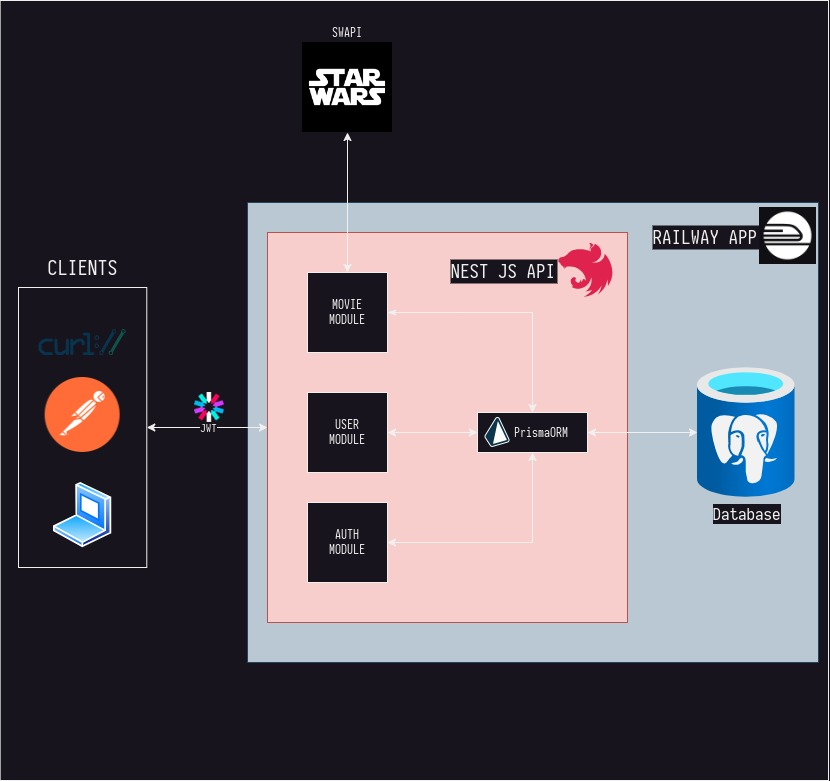

# **SW Movies Manager API**

## **Table of Contents**

1. [Introduction](#1-introduction)
2. [System Architecture](#2-system-architecture)
3. [API Structure](#3-api-structure)
    1. [Movies Module](#31-movies-module)
    2. [Authentication Module](#32-authentication-module)
    3. [User Module](#33-user-module)
4. [Database](#4-database)
    1. [Prisma & PostgreSQL](#41-prisma--postgresql)
5. [Usage](#5-usage)
6. [Future Enhancements](#6-future-enhancements)

---

## **1. Introduction**

The SW Movies & Auth API is developed to manage movie resources and handle user authentication. It fetches movie data from the SW API to seed its database. The system incorporates role-based access to facilitate different user permissions and functions. Technologies used include NestJS, Prisma for database interactions, and bcrypt for encryption.

---


## **2. System Architecture**



The provided diagram gives a comprehensive overview of the system's architectural design, highlighting the flow and integration of various technologies and components. Here's a detailed breakdown:

### **Clients:**
- **Curl & Frontend Applications:** These represent external entities that interface with our API. They make HTTP requests, which could either be for fetching movie details or managing user authentication.

### **External APIs:**
- **SWAPI:** Star Wars API (SWAPI) is the primary external data source. The system fetches movie data from SWAPI, which then gets seeded into our local database for easy access and management.

### **Main Backend Application – NestJS API:**
NestJS, a progressive Node.js framework, is chosen for its modularity, maintainability, and its compatibility with TypeScript. The NestJS application comprises several modules:

- **Movie Module:** This module interacts with the SWAPI to retrieve movie data and stores this in the local database. It provides endpoints for CRUD operations related to movies.
  
- **User Module:** This service deals with user management. It contains endpoints for user registration, details retrieval, and user updates.
  
- **Auth Module:** The authentication module is integral for securing the application. It offers endpoints for user registration, login, token refresh and logout, ensuring that only authorized users can access specific resources. JWT is used for token-based authentication.

### **Database Interaction – Prisma ORM:**
- **Prisma:** An open-source database toolkit. It allows seamless interactions with the PostgreSQL database. With Prisma, operations like data retrieval, updates, and deletions become more straightforward, eliminating the need for writing complex SQL queries.

### **Database – PostgreSQL:**
- **PostgreSQL:** A powerful, open-source object-relational database system. Given its extensibility and standards compliance, it's an excellent choice for our movie and authentication data storage.

### **External Hosting Platform:**
- **Railway App:** This cloud platform is responsible for hosting the entire application, ensuring its availability for client requests.

**Key Interactions:**
1. Clients make requests to the NestJS API.
2. For movie data, the API fetches fresh data from SWAPI and seeds it to the database upon initializing the movie module.
3. User-related requests, such as registration or login, involve interactions with the User and Auth modules. Post authentication, JWT tokens are issued for subsequent secure interactions.
4. All database interactions, be it data retrieval or updates, are handled via Prisma ORM, ensuring efficiency and security.

In summary, this architecture represents a well-orchestrated system where each component plays a pivotal role in ensuring a smooth user experience, data accuracy, and system security.

---

## **3. API Structure**

### **3.1. Movies Module**

This module handles movie resources. The endpoints provide functionalities like:

- Fetching all movies
- Fetching a movie by its ID
- Creating a new movie
- Updating a movie
- Deleting a movie

It employs guards and roles to ensure only authorized access to specific endpoints.

### **3.2. Authentication Module**

This module is vital for registering, logging in, and logging out users. Furthermore, it facilitates token refreshing. The use of tokens ensures a secure and stateless authentication mechanism. 

### **3.3. User Module**

This module is responsible for user management. Functions include:

- Finding users by email or ID
- Creating new users
- Managing refresh tokens
- Initializing an admin user based on environment configurations

---

## **4. Database**

### **4.1. Prisma & PostgreSQL**

Prisma serves as an open-source database toolkit, providing an Object-Relational Mapping (ORM) layer for the API, simplifying database interactions. PostgreSQL is employed as the primary database, chosen for its reliability and comprehensive feature set.

**Key Tables:**

1. **User**:
   - Purpose: Manage user data and authentication details.
   - Columns:
     - `id`: Unique identifier.
     - `email`: User's email address.
     - `password`: Hashed password for security.
     - `hashedRT`: Optional hashed refresh token.
     - `createdAt`: User registration timestamp.
     - `updatedAt`: Timestamp of the last update.
     - `role`: Role assigned to the user (STANDARD or ADMIN).

2. **Movie**:
   - Purpose: Store movies' information.
   - Columns:
     - `id`: Unique identifier.
     - `title`: Movie title.
     - `episodeId`: Unique episode number.
     - `openingCrawl`: The opening text crawl from the movie.
     - `director`: Director's name.
     - `producer`: Producer's name.
     - `releaseDate`: Movie release date.
     - `created`: Timestamp when the movie was added to the database.
     - `edited`: Timestamp of the last update to the movie.
     - `url`: Link to the movie on the SW API.
     - `characters`, `planets`, `starships`, `vehicles`, `species`: Lists containing links to the related resources on the SW API.

---

## **5. Usage**

1. Clone the repo

  ```bash
  git clone git@github.com:Kenobi17/sw-movies-manager.git
  ```

2. Install the dependencies 

  ```bash
  cd sw-movies-manager
  yarn install
  ```

3. Set up .env file

  ```bash
  cp .env.example .env
  ```

4. Set up local database using docker-compose

  ```bash
  docker-compose up
  ```

5. Run migrations with prisma

  ```bash
  npx prisma migrate dev
  ```

6. Set up the API

  ```bash
  yarn start
  ```

## **6. Future Enhancements**

- Incorporating more detailed logging and analytics.
- Adding unit tests for each module
- Implement OpenAPI Swagger for the API documentation
- Deploy a live demo of the API using Railways App


